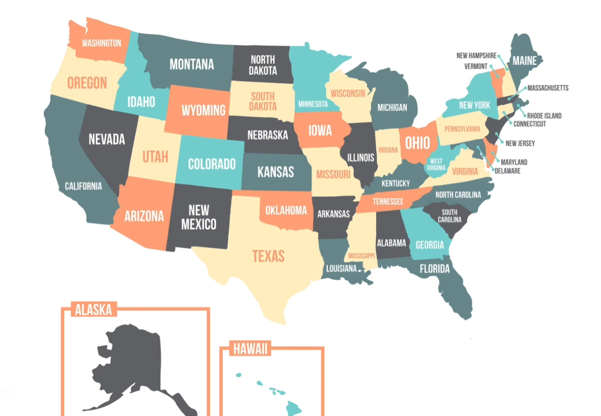

<a name="readme-top"></a>

[![Contributors][contributors-shield]][contributors-url]
[![Forks][forks-shield]][forks-url]
[![Stargazers][stars-shield]][stars-url]
[![Issues][issues-shield]][issues-url]
[![MIT License][license-shield]][license-url]
[![LinkedIn][linkedin-shield]][linkedin-url]

<!-- PROJECT LOGO -->
<br />
<div align="center">
  <a href="https://github.com/senabibi/Us_State_Game">
    
  </a>

<h3 align="center">Us State Game </h3>

  <p align="center">
     Playing a game on a manually created United States map using Pandas and Turtle in Python offers an enjoyable and educational experience. You can further enhance the project by improving graphics or adding new mechanics. Such projects combine learning and fun, providing an excellent way to develop your Python skills.
    <br />
    <a href="https://github.com/senabibi/Us_State_Game"><strong>Explore the docs »</strong></a>
    <br />
    <br />
    <a href="https://github.com/senabibi/Us_State_Game">View Demo</a>
    ·
    <a href="https://github.com/senabibi/Us_State_Game/issues">Report Bug</a>
    ·
    <a href="https://github.com/senabibi/Us_State_Game/issues">Request Feature</a>
  </p>
</div>


<!-- TABLE OF CONTENTS -->
<details>
  <summary>Table of Contents</summary>
  <ol>
    <li>
      <a href="#about-the-project">About The Project</a>
      <ul>
        <li><a href="#built-with">Built With</a></li>
      </ul>
    </li>
    <li>
      <a href="#getting-started">Getting Started</a>
      <ul>
        <li><a href="#prerequisites">Prerequisites</a></li>
        <li><a href="#installation">Installation</a></li>
      </ul>
    </li>
    <li><a href="#usage">Usage</a></li>
    <li><a href="#roadmap">Roadmap</a></li>
    <li><a href="#contributing">Contributing</a></li>
    <li><a href="#license">License</a></li>
    <li><a href="#contact">Contact</a></li>
    <li><a href="#acknowledgments">Acknowledgments</a></li>
  </ol>
</details>


## About The Project


Here's a video demonstrating the US State Game Simulator in action:

[

This project presents a unique fusion of data manipulation and game development, making learning both informative and entertaining. Leveraging Python's powerful Pandas and Turtle libraries, I crafted an engaging and educational game centered around the United States. The game involves matching the names of U.S. states on a custom map with their corresponding x and y coordinates extracted from a CSV data file. This dynamic integration of data from the real world and interactive gameplay adds a layer of excitement and relevance to the learning process. Players not only improve their Python programming skills but also gain practical experience in data utilization.

As you navigate the game, the challenge lies in correctly associating state names with their positions on the map, all while managing your allotted attempts wisely. The project's ability to seamlessly blend the practical aspects of data retrieval and the enjoyable elements of gaming enhances the overall learning experience. It not only broadens Python proficiency but also fosters an understanding of the practical applications of programming skills. By bridging the worlds of data analysis and game development, this project has evolved into an engaging, fun, and informative endeavor that promises both enjoyment and knowledge.

<p align="right">(<a href="#readme-top">back to top</a>)</p>

### Built With

* [![Python][Python.py]][Python-url]
* [![Replit][Replit.com]][Replit-url]
* [![PYCHARM][Pycharm.com]][Pycharm-url]
* [![Vısual Studio Code][vsc.com]][VSC-url]
* [![BRAVE][brave.com]][BRAVE-url]
* [![Pandas][pandas.com]][PANDAS-url]


<p align="right">(<a href="#readme-top">back to top</a>)</p>

## Getting Started

This section provides instructions on how to set up and run the project locally. Please follow these steps to get your environment ready.

### Prerequisites

Before you begin with the US State Game project, make sure you have the following prerequisites installed and ready on your system:

* [Python](https://www.python.org/downloads/): Python is the primary requirement for running this project. If you haven't already, ensure you have Python installed on your system.

* [Replit](https://replit.com): This project is designed to work seamlessly with Replit, a cloud-based development platform. You'll need a Replit account and familiarity with using the platform to get the most out of the project.

* [PyCharm](https://www.jetbrains.com/pycharm/download/): If you prefer to run the project locally using PyCharm, make sure you have PyCharm installed on your system.

* [Turtle Graphics Library](https://docs.python.org/3/library/turtle.html): Ensure that you have the Turtle graphics library installed, which is typically included with Python. Turtle graphics will be used to create the interactive map in the game.

* [Pandas Library](https://pandas.pydata.org/): The game relies on the Pandas library for data handling and extraction. Make sure you have Pandas installed as it will be used to manage the data file containing state coordinates.

* Data File: The project utilizes a CSV data file that contains state names along with their respective x and y coordinates. Ensure you have access to this data file for a smooth gaming experience.

These prerequisites will enable you to run and enjoy the US State Game project, where you'll have the opportunity to learn and have fun by matching state names with their map positions.


### Installation

Follow these steps to install and run the US State Game project, which combines Python programming, Turtle graphics, and data handling with Pandas:

1. **Python Installation:**
   - Ensure you have Python installed on your system. If not, download and install Python from the [official Python website](https://www.python.org/downloads/).

2. **Replit Usage:**
   - You can easily run this project on Replit by following these steps:
     - Create a Replit account if you don't have one.
     - Import the US State Game project into Replit or create a new Replit project.
     - Open the main Python script in Replit and run it.

3. **PyCharm Installation and Usage:**
   - Download and install PyCharm from the [official website](https://www.jetbrains.com/pycharm/download/).
   - Open the US State Game project in PyCharm.
   - Configure PyCharm to use the installed Python interpreter.

4. **Pandas Library:**
   - The US State Game project utilizes the Pandas library for data handling and extraction. Ensure you have Pandas installed to manage the data file containing state coordinates. You can install Pandas using pip:
     ```
     pip install pandas
     ```

5. **Data File:**
   - To run the game effectively, make sure you have access to the data file, a CSV that contains state names and their corresponding x and y coordinates.

By following these steps, you can run the US State Game project either in Replit or locally in PyCharm, depending on your preference. This project provides an enjoyable way to enhance your Python skills while having fun with U.S. state geography.

<p align="right">(<a href="#readme-top">back to top</a>)</p>


## Usage

To play the US State Game project and set up your environment for an interactive and educational experience, follow these steps:

1. **Python Installation:**
   - Ensure that Python is installed on your system. If it's not already installed, you can download and install Python from the [official Python website](https://www.python.org/downloads/).

2. **Pandas Library and Data File Setup:**
   - Start by setting up the Pandas library. You can install it using pip with the following command:
     ```
     pip install pandas
     ```
   - Prepare the data file containing state names and their corresponding x and y coordinates. Ensure the data file is accessible and ready to be used in the project.

3. **Running the Game:**
   - Open your terminal or command prompt, navigate to the project's directory, and run the main Python script:
     ```
     python us_state_game.py
     ```
   - This command will launch the US State Game.

4. **Game Objective:**
   - Your goal in the US State Game is to match the state names with their correct locations on the map. As you compare the data in the file with the map, the matched data will be displayed on the map.

5. **Enjoy Learning:**
   - Have fun while enhancing your knowledge of U.S. state geography. The game not only entertains but also educates, making it an enjoyable learning experience.

By following these steps, you can set up your environment to play the US State Game, where you'll test your knowledge and improve your data handling skills with Pandas while having a great time exploring the map and its details.

<p align="right">(<a href="#readme-top">back to top</a>)</p>


## Roadmap

- [ ] Python Installation: Enabling Python to be correctly installed for project development.

- [ ] Pandas Library and Data File Setup: Preparing the Pandas library and configuring the data file containing state names and their x and y coordinates.

- [ ] Map Creation: Designing a blank map on which state names and their positions will be displayed.

- [ ] Data Matching: Implementing the logic to match the state names with their correct positions on the map based on the data file.

- [ ] User Interaction: Creating an interactive user interface for input and feedback.

- [ ] Scoring System: Developing a scoring system to record the progress and provide an engaging gaming experience.

- [ ] Game Over Condition: Implementing a condition for successfully completing the game.

- [ ] Testing and Debugging: Rigorously testing the game, addressing any potential issues or bugs.

- [ ] Documentation: Preparing user documentation that explains how to play the game and make the most of the project.

This roadmap outlines a step-by-step plan for the development of the US State Game project, ensuring that it's both educational and entertaining. It covers initial setup, data handling, user interaction, scoring, and testing, creating an interactive experience for players.

<p align="right">(<a href="#readme-top">sayfa başına dön</a>)</p>


## Contributing

Contributions are what make the open-source community such an amazing place to learn, inspire, and create. Any contributions you make are **greatly appreciated**.

If you have a suggestion that would make this project better, please fork the repository and create a pull request. You can also simply open an issue with the "enhancement" tag.
Don't forget to give the project a star! Thanks again!

1. Fork the Project
2. Create your Feature Branch (`git checkout -b feature/AmazingFeature`)
3. Commit your Changes (`git commit -m 'Add some AmazingFeature'`)
4. Push to the Branch (`git push origin feature/AmazingFeature`)
5. Open a Pull Request

<p align="right">(<a href="#readme-top">back to top</a>)</p>


## License

Distributed under the MIT License. See `LICENSE.txt` for more information.

<p align="right">(<a href="#readme-top">back to top</a>)</p>


## Contact

Nursena Bitirgen - [LinkedIn](https://www.linkedin.com/in/nursena-bitirgen-5743341b9/)

Project Link: [https://github.com/senabibi/Us_State_Game](https://github.com/senabibi/Us_State_Game)

<p align="right">(<a href="#readme-top">back to top</a>)</p>


## Acknowledgments

The development of the US State Game project was made possible thanks to the following resources and skills:

* **Python Knowledge:** Special thanks to the Python programming language for its robust and versatile capabilities that formed the backbone of this project.
* **Object-Oriented Programming (OOP) Expertise:** Acknowledgment to the principles of OOP, which played a pivotal role in structuring the project's code and logic.
* **Data Structure Proficiency:** Gratitude for the knowledge of data structures, which was essential for handling and matching the state data from the data file.
* **Turtle Graphics Proficiency:** Special acknowledgment for the proficiency in using Turtle graphics, which brought the visual elements of the project to life and made the map interactive.
* **Pandas Library:** The Pandas library, known for its data manipulation capabilities, was instrumental in managing and matching state data from the data file.
* **CSV Data File:** A special mention to the data file that contained state names and their x and y coordinates, serving as the foundation of the game.
* **Replit Proficiency:** The ability to work with Replit was instrumental in the development of this project and allowed for a smooth development experience.

<p align="right">(<a href="#readme-top">sayfa başına dön</a>)</p>


<!-- MARKDOWN LINKS & IMAGES -->
<!-- https://www.markdownguide.org/basic-syntax/#reference-style-links -->
[contributors-shield]: https://img.shields.io/github/contributors/senabibi/Us_State_Game.svg?style=for-the-badge
[contributors-url]: https://github.com/senabibi/Us_State_Game/graphs/contributors
[forks-shield]: https://img.shields.io/github/forks/senabibi/Us_State_Game.svg?style=for-the-badge
[forks-url]: https://github.com/senabibi/Us_State_Game/network/members
[stars-shield]: https://img.shields.io/github/stars/senabibi/Us_State_Game.svg?style=for-the-badge
[stars-url]: https://github.com/senabibi/Us_State_Game/stargazers
[issues-shield]: https://img.shields.io/github/issues/senabibi/Us_State_Game.svg?style=for-the-badge
[issues-url]: https://github.com/senabibi/Us_State_Game/issues
[license-shield]: https://img.shields.io/github/license/senabibi/Us_State_Game.svg?style=for-the-badge
[license-url]: https://github.com/senabibi/Us_State_Game/blob/master/LICENSE.txt
[linkedin-shield]: https://img.shields.io/badge/-LinkedIn-black.svg?style=for-the-badge&logo=linkedin&colorB=555
[linkedin-url]: https://www.linkedin.com/in/nursena-bitirgen-5743341b9/
[product-screenshot]: images/logo.png

[Python.py]: https://img.shields.io/badge/Python-3776AB?style=for-the-badge&logo=python&logoColor=white
[Python-url]: https://docs.python.org/3/

[Replit.com]: https://img.shields.io/badge/replit-667881?style=for-the-badge&logo=replit&logoColor=white
[Replit-url]: https://replit.com/

[Pycharm.com]: https://img.shields.io/badge/PyCharm-000000.svg?&style=for-the-badge&logo=PyCharm&logoColor=white
[Pycharm-url]: https://www.jetbrains.com/pycharm/

[vsc.com]: 	https://img.shields.io/badge/Visual_Studio_Code-0078D4?style=for-the-badge&logo=visual%20studio%20code&logoColor=white
[VSC-url]: https://code.visualstudio.com/

[brave.com]:https://img.shields.io/badge/Brave-FF1B2D?style=for-the-badge&logo=Brave&logoColor=white
[BRAVE-url]: https://brave.com/

[pandas.com]:https://img.shields.io/badge/pandas-%23150458.svg?style=for-the-badge&logo=pandas&logoColor=white
[PANDAS-url]: https://pandas.pydata.org/


